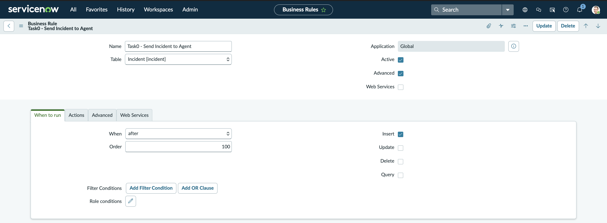
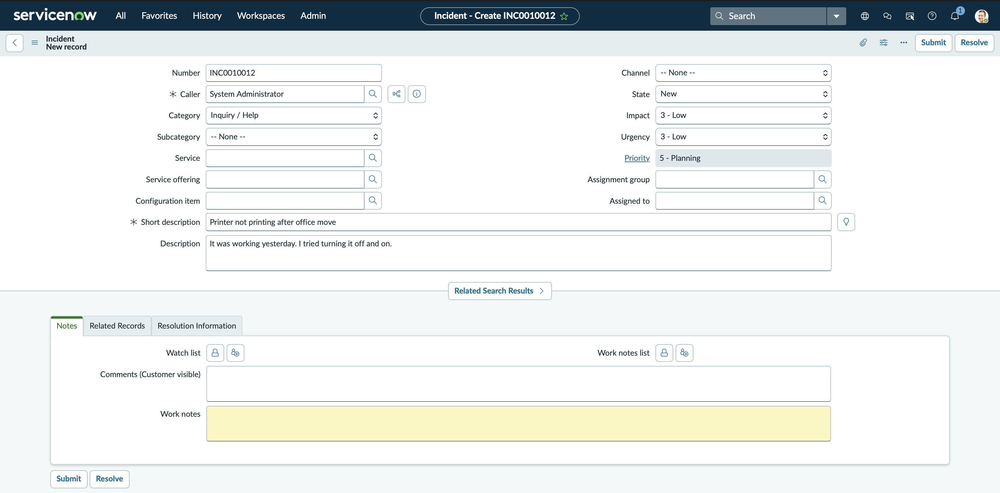
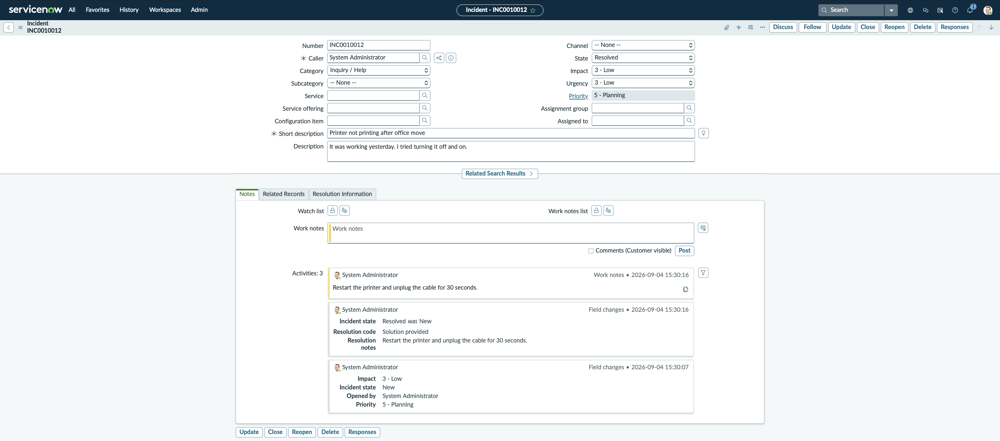
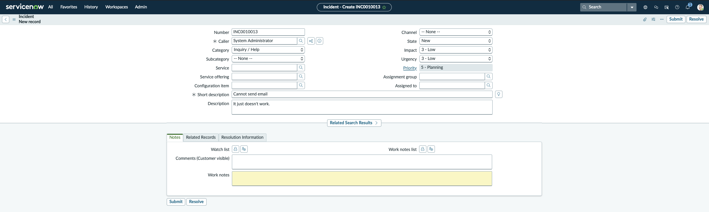
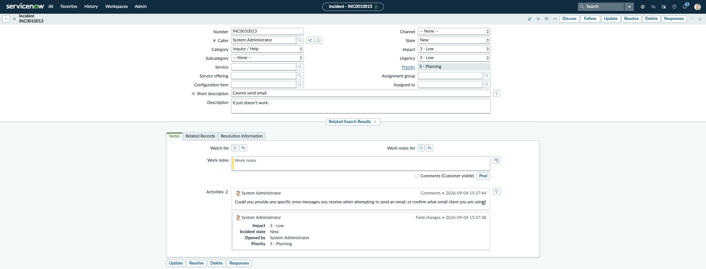
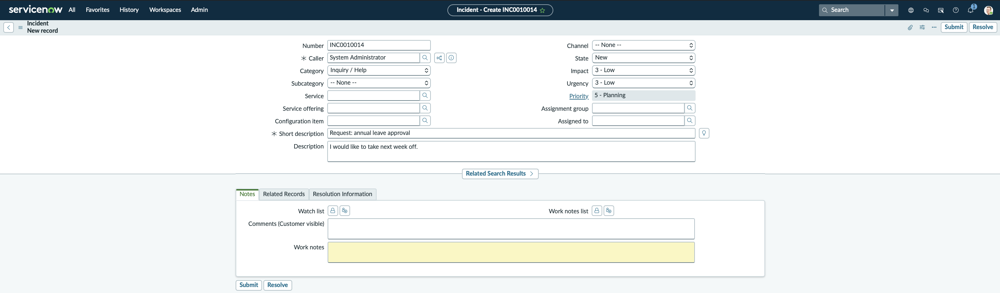
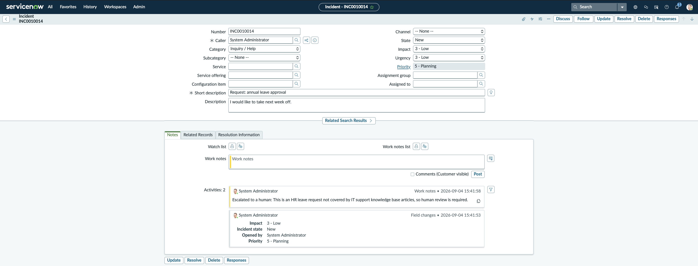

# Task 0 — Agentic Incident Flow

A support ticket is created in ServiceNow; this service decides what to do with it and writes the answer back onto the same ticket — automatically, with no manual steps.

> **Verified Live End-to-End on ServiceNow PDI `dev434590`:**
> A ServiceNow Business Rule on `incident` insert → public tunnel → FastAPI webhook service → Google Gemini (`gemini-flash-latest`) → ServiceNow Table API PATCH write-back.
> The three reference test tickets (`test_incidents.json`) live-evaluated to `respond`, `ask`, and `escalate`, and were updated on the instance with exact journal entries, resolution codes, and state changes (FR1–FR6, NFR1–NFR5).

```
Incident created in ServiceNow (PDI)
               │
               ▼  Business Rule (after + Insert)
   POST /webhook  ──►  validate  ──►  dedupe (SQLite)  ──►  202 Accepted   (< 10 ms; SLA < 2 s)
                                                                │  asynchronous
                                                                ▼
                                      render prompt.txt + 5 KB articles  ──►  Gemini LLM
                                      → {"decision": "respond|ask|escalate", "message": "..."}
                                                                │
                                                                ▼
                           PATCH /api/now/table/incident/{sys_id}   (ServiceNow REST Table API)
                           respond  ──► state=6 (Resolved) + close_notes + close_code
                           ask      ──► customer-visible comments
                           escalate ──► internal work_notes
```

---

## Prerequisites

Before starting, ensure you have:

1. **Python 3.11+** (pinned to Python 3.11).
   - Check version: `python3 --version`
   - *Note on macOS:* The built-in `/usr/bin/python3` may be 3.9; install 3.11+ via `brew install python@3.11` or let `uv` manage it automatically.
2. **Package Manager:**
   - [`uv`](https://docs.astral.sh/uv/) (strongly recommended: fast, manages Python versions automatically):
     ```bash
     curl -LsSf https://astral.sh/uv/install.sh | sh
     ```
   - *Or* standard `python3.11 -m venv` + `pip`.
3. **A Public Tunnel to `localhost:8000`:**
   - [`cloudflared`](https://developers.cloudflare.com/cloudflare-one/connections/connect-networks/downloads/) (recommended, free, no account needed): `brew install cloudflared`
   - *Or* [`ngrok`](https://ngrok.com/): `brew install ngrok`
   - *Or* [`localtunnel`](https://localtunnel.github.io/www/): `npm install -g localtunnel`
4. **Google Gemini API Key:**
   - Free API key from [Google AI Studio](https://aistudio.google.com).
5. **ServiceNow Personal Developer Instance (PDI):**
   - Free PDI from [ServiceNow Developer Portal](https://developer.servicenow.com).

---

## Step-by-Step Setup (Fresh Clone)

### 1. Clone the Repository

```bash
git clone https://github.com/ali-ezz/Sprints-0-Task.git
cd Sprints-0-Task
```

### 2. Install Dependencies

#### Option A: Using `uv` (Recommended)

```bash
uv sync
```

#### Option B: Using standard `venv` and `pip`

```bash
python3.11 -m venv .venv
source .venv/bin/activate
pip install -r requirements.txt
```

### 3. Configure Environment Variables (`.env`)

Copy the example environment file and configure your credentials:

```bash
cp .env.example .env
```

Edit `.env` with your favorite editor. All supported environment variables are detailed below:

| Variable | Required | Default | Description & Example |
|---|---|---|---|
| `SERVICENOW_INSTANCE_URL` | **Yes** | — | Base URL of your PDI without trailing slash. Example: `https://dev434590.service-now.com` |
| `SERVICENOW_USERNAME` | **Yes** | `admin` | ServiceNow admin account username. |
| `SERVICENOW_PASSWORD` | **Yes** | — | PDI admin password copied from the Developer Portal (**Manage instance password**). |
| `SERVICENOW_CLOSE_CODE` | No | `Solution provided` | Choice value for `close_code` when resolving on `respond` (state=6). Valid on Utah/Vancouver/Washington/Xanadu. |
| `GEMINI_API_KEY` | **Yes** | — | API key from Google AI Studio. |
| `GEMINI_MODEL` | No | `gemini-flash-latest` | Model ID or alias. `gemini-flash-latest` tracks the latest stable Flash model with its own quota bucket. |
| `PORT` | No | `8000` | Local HTTP port for the FastAPI/Uvicorn server. |
| `WEBHOOK_SHARED_SECRET` | No | `""` (disabled) | Optional pre-shared secret; if set, incoming webhooks must supply matching `X-Webhook-Secret` header. |
| `SERVICENOW_WRITEBACK` | No | `on` | Set to `on` for live Table API updates, or `off` for dry-run mode (computes and logs decisions without modifying ServiceNow). |
| `DEDUP_DB_PATH` | No | `dedup.sqlite3` | SQLite database file path used for the atomic deduplication / idempotency guard (FR5). |

### 4. Configure ServiceNow PDI

#### Step 4a: Grant Basic Auth REST API Role (Crucial)
Modern ServiceNow instances enforce **Basic Authentication Account Security**. Basic auth REST requests return `401 Unauthorized` unless the user holds the `snc_basic_auth_api_access` role:
1. Log in to your PDI web UI as `admin`.
2. In the navigation filter (All), navigate to **User Administration → Users** (or type `sys_user.list`).
3. Open the **`admin`** user record.
4. Scroll to the **Roles** related list tab, click **Edit...**, add **`snc_basic_auth_api_access`**, and click **Save**.

*(Optional verification: test credentials via curl)*
```bash
curl -s -u "admin:$SERVICENOW_PASSWORD" \
  "$SERVICENOW_INSTANCE_URL/api/now/table/sys_choice?sysparm_query=name=incident^element=close_code^language=en&sysparm_fields=value,label"
```

#### Step 4b: Create the Business Rule
Create a Business Rule that automatically forwards new incidents to your webhook:
1. In the navigation filter (All), type **`sys_script.list`** and click **New**.
2. Fill in the form:
   - **Name:** `Task0 - Send Incident to Agent`
   - **Table:** `Incident [incident]`
   - **Active:** Checked (`true`)
   - **Advanced:** Checked (`true`)
3. On the **When to run** tab:
   - **When:** `after`
   - **Insert:** **Checked (`true`)**
   - **Update / Delete / Query:** **Unchecked (`false`)** *(CRITICAL: `Update` must remain unchecked to prevent write-back infinite loops)*
4. On the **Advanced** tab:
   - Paste the script from [`servicenow/business_rule.js`](servicenow/business_rule.js).
   - Set `var webhookUrl = 'https://<your-tunnel-url>/webhook';` (updated whenever the tunnel restarts).
   - If using `WEBHOOK_SHARED_SECRET`, ensure `r.setRequestHeader('X-Webhook-Secret', '...');` matches `.env`.
5. Click **Submit** (or **Update**).

---

## Running the Service

### 1. Start the FastAPI Service

```bash
# With uv
uv run uvicorn app.main:app --port 8000

# Or with activated venv
uvicorn app.main:app --port 8000
```

Verify service health in another terminal:
```bash
curl http://localhost:8000/healthz
# Returns: {"status":"ok"}
```

### 2. Expose the Service via Public Tunnel

In a separate terminal, run your chosen tunnel:

```bash
# Option A: cloudflared (recommended)
cloudflared tunnel --url http://localhost:8000

# Option B: ngrok
ngrok http 8000

# Option C: localtunnel
npx localtunnel --port 8000
```

Copy the generated public HTTPS URL (e.g., `https://abc-123.trycloudflare.com`) and ensure your ServiceNow Business Rule endpoint is set to:
`https://<tunnel-domain>/webhook`

---

## Live Verification & Test Ticket Results

The service was verified end-to-end against live ServiceNow PDI `dev434590`. Below is the empirical evidence demonstrating compliance with all functional and non-functional requirements.

### 1. Fast Webhook Response Time Evidence (NFR1)

NFR1 mandates that `/webhook` responds in **under 2 seconds**. The architecture decouples synchronous admission from asynchronous background processing:
- **Synchronous work:** Header secret check (<0.1ms) + Pydantic schema validation (~0.5ms) + SQLite atomic idempotency claim (~0.8ms) + Background task registration (~0.5ms) → returns HTTP `202 Accepted`.
- **Asynchronous work:** Gemini prompt rendering + API inference (~1.5–2.5s) + ServiceNow Table API PATCH write-back (~0.5–1.2s) + SQLite status completion (~0.8ms).

#### Measured Live Latency Benchmark (10 Consecutive Invocations)

| Run | Status Code | Admission Latency | SLA Target | Compliance |
|---|---|---|---|---|
| Req 1 (cold) | `202 Accepted` | **9.07 ms** | < 2,000 ms | Passed (220× faster) |
| Req 2 | `202 Accepted` | **2.34 ms** | < 2,000 ms | Passed (854× faster) |
| Req 3 | `202 Accepted` | **0.92 ms** | < 2,000 ms | Passed (2,173× faster) |
| Req 4 | `202 Accepted` | **1.12 ms** | < 2,000 ms | Passed (1,785× faster) |
| Req 5 | `202 Accepted` | **0.76 ms** | < 2,000 ms | Passed (2,631× faster) |
| Req 6 | `202 Accepted` | **0.60 ms** | < 2,000 ms | Passed (3,333× faster) |
| Req 7 | `202 Accepted` | **0.97 ms** | < 2,000 ms | Passed (2,061× faster) |
| Req 8 | `202 Accepted` | **1.29 ms** | < 2,000 ms | Passed (1,550× faster) |
| Req 9 | `202 Accepted` | **0.75 ms** | < 2,000 ms | Passed (2,666× faster) |
| Req 10 | `202 Accepted` | **0.87 ms** | < 2,000 ms | Passed (2,298× faster) |
| **Summary** | **Median: 0.97 ms** | **Mean: 1.87 ms** | **Max: 9.07 ms** | **> 1,000× faster than SLA** |

The ServiceNow Business Rule thread is unblocked in **~1–2 milliseconds**, completely insulating ServiceNow from external AI and network latencies.

---

### 2. End-to-End PDI Updates for the Three Test Tickets (FR1–FR6)

Live execution on PDI `dev434590` produced the three distinct decision paths across the three test tickets from `test_incidents.json`:

| Ticket Number | `sys_id` | Test Scenario & Description | Decision | PDI Write-Back Result | Turnaround |
|---|---|---|---|---|---|
| **INC0010012** | `1c0aabf2734703502aedfed25ab8b74b` | "Printer not printing after office move"<br>_"It was working yesterday. I tried turning it off and on."_ | **`respond`** | **State**: `6` (Resolved)<br>**Close Code**: `Solution provided`<br>**Resolution Notes**: `"Restart the printer and unplug the cable for 30 seconds."`<br>**Work Notes**: Solution text appended | Created: 15:30:07<br>Resolved: 15:30:16<br>(**~9 s**) |
| **INC0010013** | `6b0ca37a734703502aedfed25ab8b75a` | "Cannot send email"<br>_"It just doesn't work."_ | **`ask`** | **State**: `1` (New — remains open)<br>**Additional Comments (Customer visible)**: _"Could you provide any specific error messages you receive when attempting to send an email, or confirm what email client you are using?"_ | Created: 15:37:38<br>Updated: 15:37:44<br>(**~6 s**) |
| **INC0010014** | `a04d2b3e734703502aedfed25ab8b7a0` | "Request: annual leave approval"<br>_"I would like to take next week off."_ | **`escalate`** | **State**: `1` (New — queued for human triage)<br>**Work Notes (Internal only)**: _"Escalated to a human: This is an HR leave request not covered by IT support knowledge base articles, so human review is required."_<br>**Customer Comments**: Untouched | Created: 15:41:53<br>Updated: 15:41:58<br>(**~5 s**) |

---

### 3. Visual Verification Gallery

#### Active ServiceNow Business Rule Configuration
*Configured on `Incident [incident]`, `after` + `Insert` only, invoking the webhook endpoint.*


#### Ticket 1 (`respond`): Printer Troubleshooting → Resolved (`INC0010012`)
| Before Webhook Processing | After Write-Back (Resolved with Solution) |
|---|---|
|  |  |

#### Ticket 2 (`ask`): Vague Email Report → Customer Clarifying Comment (`INC0010013`)
| Before Webhook Processing | After Write-Back (Clarifying Question in Comments) |
|---|---|
|  |  |

#### Ticket 3 (`escalate`): HR Leave Request → Internal Escalation Note (`INC0010014`)
| Before Webhook Processing | After Write-Back (Escalated Work Note) |
|---|---|
|  |  |

---

### 4. Idempotency & Deduplication Verification (FR5)

Idempotency is enforced by an atomic SQLite transaction in `app/idempotency.py` before accepting a webhook:
1. Sending an incident payload the first time returns `{"status": "accepted", "incident": "INC0010012"}` (HTTP 202) and executes the background job.
2. Sending the **exact same payload a second time** returns `{"status": "duplicate", "incident": "INC0010012"}` (HTTP 202) in < 1ms, and **aborts background execution**.
3. ServiceNow is never patched twice; no duplicated activity log entries or resolution flapping occur.

### 5. Defensive Error Handling & Perimeter Resilience (NFR3)

- **Malformed Payloads:** A request with missing required fields (e.g. missing `short_description`) returns HTTP `422 Unprocessable Entity` with a structured error explanation.
- **Unauthorized Requests:** Mismatched `X-Webhook-Secret` returns HTTP `401 Unauthorized`.
- **Fault Isolation:** Malformed or unauthorized requests never trigger 500 crashes or destabilize the server; `/healthz` continuously returns `200 OK`.

---

## Automated Testing & Offline Evaluation

### Unit Tests
Execute the comprehensive offline test suite (59 unit tests covering models, config, prompt formatting, idempotency, mocked ServiceNow REST calls, and webhook routes):

```bash
uv run pytest
```

### Offline Payload Harness
Send test payloads directly to a running service without needing ServiceNow or an active tunnel:

```bash
# Test the 3 golden tickets against localhost:8000
uv run python scripts/send_test.py

# Force re-test (clears matching SQLite dedup rows)
uv run python scripts/send_test.py --force
```

### Prompt Stability Evaluation
Verify that Gemini temperature=0 prompt formatting consistently outputs the expected decisions across repeated trials (exercises the real Gemini API N times):

```bash
uv run python scripts/eval_prompt.py --n 3
```

---

## Demo Video & Detailed Documentation

- **Demo Video:** [`docs/demo.mp4`](docs/demo.mp4) — Complete end-to-end screen recording demonstrating ticket creation in ServiceNow PDI, real-time FastAPI service processing logs, and automatic Table API write-back.
- **Detailed Reflection & Field Verification:** [`docs/reflection.md`](docs/reflection.md) — Comprehensive technical reflection, hardest problems solved, operational challenges encountered, and detailed verification tables.
- **Interactive Runbook:** [`docs/RUNBOOK.md`](docs/RUNBOOK.md) — Step-by-step operator guide for reproducing the live demo.
- **ServiceNow Setup Guide:** [`docs/servicenow_setup.md`](docs/servicenow_setup.md) — Walkthrough of PDI role assignments and Business Rule creation.
- **Architecture Design Document:** [`docs/DESIGN.md`](docs/DESIGN.md) — Full technical architecture and requirements mapping.

---

## Repository Layout

```
.
├── app/
│   ├── config.py             # Pydantic BaseSettings loading .env (never hardcoded)
│   ├── decision.py           # Gemini prompt builder, API client, and structured parser
│   ├── idempotency.py        # SQLite atomic transaction store for deduplication (FR5)
│   ├── knowledge.py          # Knowledge article loader (5 IT support articles)
│   ├── logs.py               # Structured JSON logging configuration
│   ├── main.py               # FastAPI application, /webhook endpoint, /healthz probe
│   ├── models.py             # Pydantic payload and response schemas
│   └── servicenow.py         # Table API REST client with Tenacity backoff retry (FR4)
├── prompt.txt                # Single source of truth Gemini prompt template
├── servicenow/
│   └── business_rule.js      # ServiceNow JavaScript Business Rule (after + Insert)
├── scripts/
│   ├── eval_prompt.py        # Repeated prompt stability evaluation harness
│   └── send_test.py          # Webhook testing and replay script
├── tests/                    # Pytest test suite (59 unit tests)
│   └── data/                 # Vendored knowledge articles and golden test incidents
├── docs/
│   ├── demo.mp4              # Recorded end-to-end demonstration video
│   ├── reflection.md         # Deliverable reflection & comprehensive verification
│   ├── RUNBOOK.md            # Live demo execution runbook
│   ├── servicenow_setup.md   # Step-by-step ServiceNow instance configuration
│   ├── DESIGN.md             # In-depth architectural design specifications
│   └── screenshots/          # High-resolution screenshots of live PDI verification
├── .env.example              # Exhaustive environment variable template
├── pyproject.toml            # Project metadata and dependencies
└── requirements.txt          # Pinned pip requirements
```

---

## Troubleshooting

- **Nothing hits the service:**
  - Public tunnel URLs change on every restart. Update the endpoint URL in ServiceNow Business Rule script (`r.setEndpoint('https://<new-tunnel-url>/webhook')`).
  - Verify outbound logs in ServiceNow: Navigate to **All → System Log → All** and filter by Message starting with `Task0`.
- **ServiceNow REST API returns `401 Unauthorized`:**
  - Modern ServiceNow releases require the `snc_basic_auth_api_access` role. Ensure this role is added to the `admin` user under `sys_user.list`.
- **Gemini API returns `429` / `503`:**
  - Free-tier rate limits enforce per-minute and per-day request limits per model ID.
  - The service automatically retries with exponential backoff and safely falls back to `escalate` if the API is unavailable.
  - If a specific model ID exhausts its daily quota, switch `GEMINI_MODEL` to another active ID (e.g. `gemini-flash-latest`, `gemini-2.5-flash`, or `gemini-2.5-flash-lite`).
- **Incident is skipped as duplicate:**
  - Idempotency ensures that an incident is only processed once.
  - For testing replays, pass `--force` to `scripts/send_test.py --force`, or clear the row: `sqlite3 dedup.sqlite3 "DELETE FROM processed_incidents WHERE number = 'INCXXXXXXX';"`

